# Workshop 1 — RICE Scoring & 2×2 Value-Effort Matrix

**Product:** AI agent hội thoại tiếng Việt phân khoa cho bệnh nhân ngoại trú  
**Student:** Nguyễn Trọng Tiến

---

## RICE Table

| # | Tính năng | Reach (user/quý) | Impact (0.25–3) | Confidence | Effort (person-month) | RICE Score |
|---|-----------|-----------------|-----------------|------------|-----------------------|------------|
| 1 | Agent hội thoại sàng lọc đa vòng hỏi triệu chứng 3–5 vòng bằng tiếng Việt, gợi ý 1 chuyên khoa phù hợp | 15000 | 3 | 80% | 3 | 12000 |
| 2 | Escalation flow sau 3 vòng confidence < 70%, chuyển transcript sang nhân viên tiếp nhận | 3000 | 2 | 50% | 1.5 | 2000 |
| 3 | Booking confirmation flow hiển thị bác sĩ + slot khả dụng real-time, bệnh nhân xác nhận đặt lịch | 12000 | 2 | 70% | 2 | 8400 |
| 4 | Safety rule layer cho keyword matching red flag cấp cứu, chạy trước LLM, hiển thị cảnh báo đỏ + escalate cấp cứu | 15000 | 3 | 100% | 1 | 45000 |
| 5 | Hỗ trợ bản đồ đến khoa khám cho user | 1000 | 2 | 60% | 2 | 300 |

---

## Value-Effort Matrix:

---